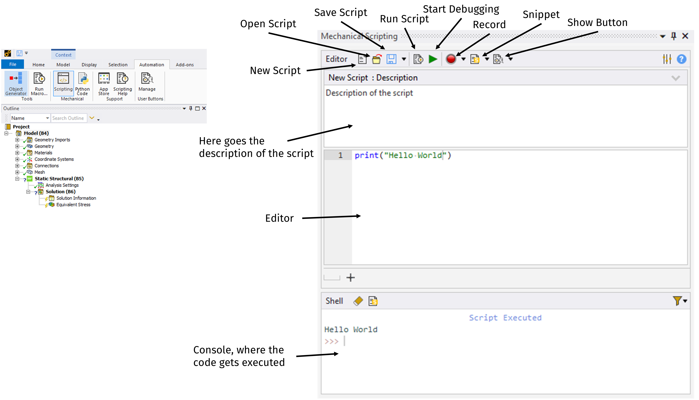
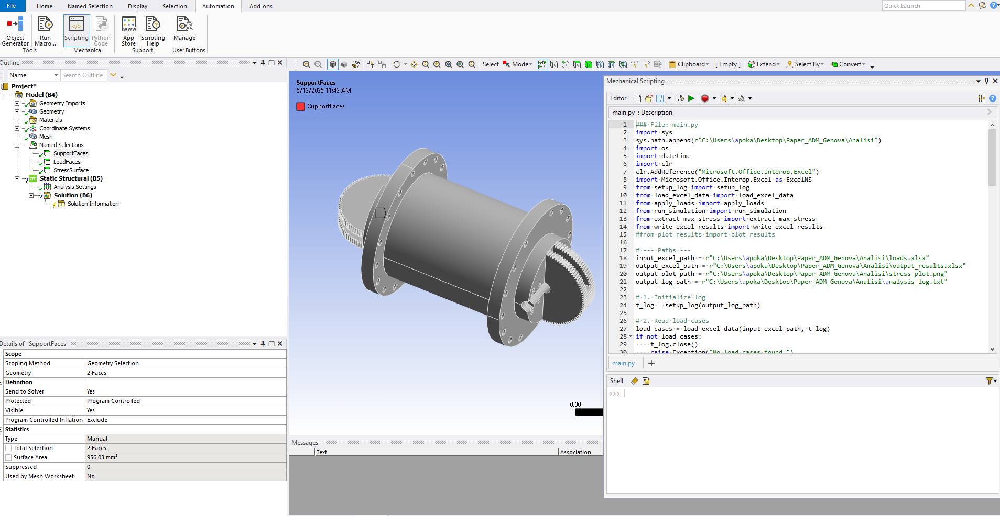
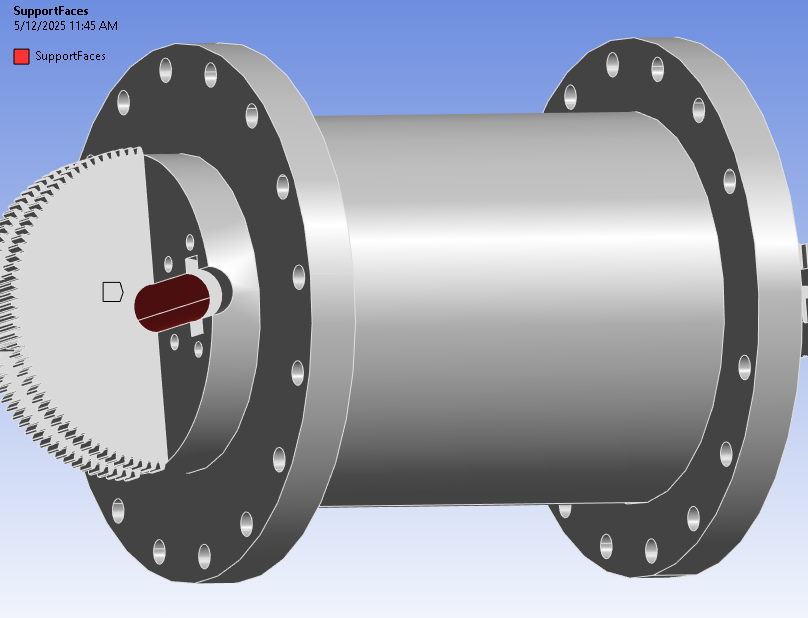
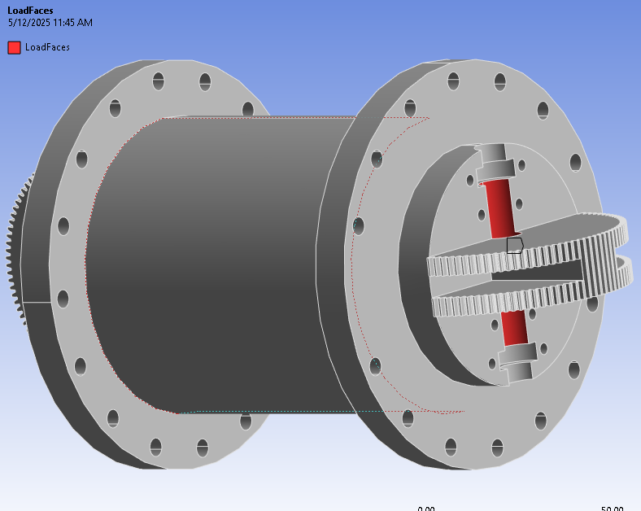
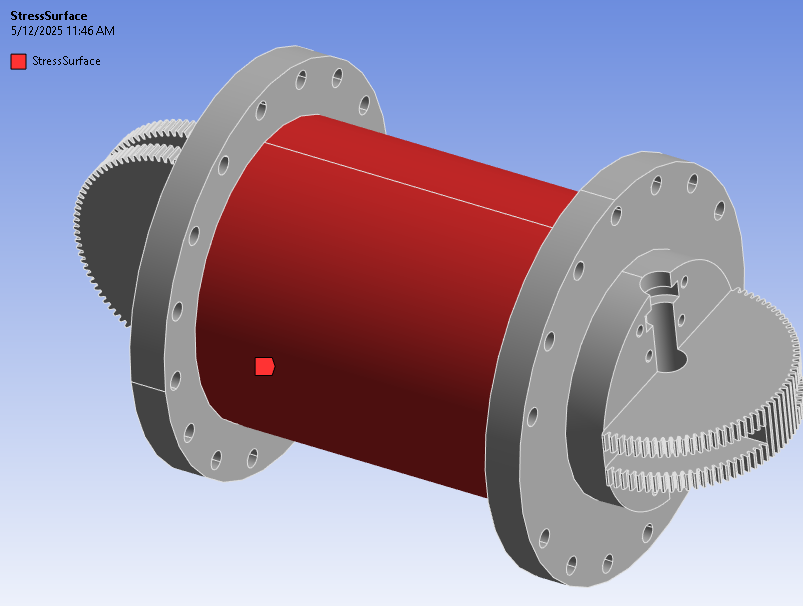

<h1> Automation of the Structural Analysis on a Robot Link via Scripting in Ansys Workbench: A Tutorial </h1>

 This automation toolkit is designed for users of ANSYS Mechanical Workbench who need to perform a large number of static structural simulations. 
Specifically, multiple load cases are applied to a common geometry, such as a robotic joint or mechanical assembly. 
Instead of manually changing loads and solving each case one by one, this Python script automates the entire process. 

 Using the ANSYS scripting API (ExtAPI) along with Microsoft Excel COM interop, the script reads a list of force and moment inputs from an Excel file,
applies them in sequence, solves each case, and logs the maximum von Mises stress results.
Output includes: 
<ul>
	<li>A structured Excel file containing the input and resulting stress for each case</li>
	<li>A line plot visualising stress trends across load cases</li>
	<li>A detailed log of all simulation steps, useful for troubleshooting and verification</li>
</ul>

This project is modularised for clarity and maintainability. Each major task (e.g. reading data, applying loads, solving, writing output) is encapsulated in its own script.
The main.py script coordinates these modules to execute the complete automation workflow.
This project is tailored to ANSYS users familiar with structural simulation workflows.

Before starting the simulation, the simulation environment must be set up. Firstly, the CAD model named "link1" should be imported into the Workbench Static Structural project and attached to *Geometry*.
Then, the scripting console should be accessed via *Automation* -> *Scripting*.
Below is presented the ACT Console and its functionalities:

By clicking on *open script* on the ACT Console, the main script can be loaded into the Editor.
The Ansys Project should appear as follows:

As can be seen from the image, there are three named selections in the model tree, corresponding to the support surface, the load surface, and the stress scoping surface, respectively.
The following images show the surfaces corresponding to each named selection.

| **Support Surface**             | **Load Surface**                                 | **Stress Surface**                                |
|:-------------------------------:|:------------------------------------------------:| :------------------------------------------------:|
|     |                         |                      |

After having prepared the Workbench environment for the simulation, the main script of the automation must be uploaded on the console, by clicking on *open script*.

The *main.py* file is the entry point. It:
<ul>
	<li>Defines all file paths (input loads, output results, plot image, and log)</li>
 	<li>Initialises a log via setup_log, so directory creation and header writing happen in one place</li>
  	<li>Loads the Excel data using load_excel_data, yielding a list of (Fx, Fy, Fz, Mx, My) tuples</li>
   	<li>Fetches the ANSYS model and analysis objects from the Workbench API (ExtAPI)</li>
    	<li>Locates the “JointSurfaces” named selection for scoping loads</li>
     	<li>Adds Force and Moment objects (component‐defined) and ensures an Equivalent Stress result is ready</li>
      	<li>Loops over every load case</li>
       	<li>Applies the current load</li>
	<li>Calls run_simulation; if it fails, logs "Solve failed" and records None</li>
	<li>On success, extracts the max von Mises stress with extract_max_stress, logs it, and appends it</li>
	<li>Writes out the Excel results with write_excel_results</li>
	<li>Plots stress vs. case index using plot_results</li>
	<li>Closes the log with an end timestamp</li>
</ul>

<h2>FUNCTIONS</h2>

The functions used in the main code are summarized in the following.

*setup_log.py* summarises all log-file setup:
<ul>
	<li>Directory creation: Ensures the log’s parent folder exists. </li>
	<li>File opening: Opens analysis_log.txt for writing (overwriting any old log). </li>
	<li>Header writing: Stamps the start time and log path. </li>
	<li>Return value: an open file handle (log_file) that every other module writes into. </li>
</ul>

*load_excel_data.py* handles Excel input via COM interop:

<ul>
	<li>References Microsoft.Office.Interop.Excel to drive Excel invisibly. </li>
	<li>Opens the workbook, picks the first worksheet, and finds the last used row in column A.</li>
	<li>Iterates rows 1 – last, reading five columns: Fx, Fy, Fz, Mx, My.</li>
	<li>Filters out any row missing a value.</li>
	<li> Closes/quits Excel and releases COM objects to avoid open background Excel processes.</li>
	<li> Logs the count of load cases read.</li>
	<li> Returns a list of tuples (5 floats).</li>
</ul>

*run_simulation.py* Keeps the solve‐and‐error logic in one spot:
<ul>
	<li>Calls analysis.Solve() inside a try/except.</li>
	<li>On success, returns True.</li>
	<li>On solver exceptions, logs the error message, returns False.</li>
	<li>Because the function gives back a True or a False, the loop can easily check whether to continue or skip, without messy logic.</li>
</ul>

*extract_max_stress.py* : After a successful solve, this module:

<ul>
	<li>Calls stress_result.EvaluateAllResults() to refresh result data.</li>
	<liReads stress_result.Maximum, which holds the peak von Mises stress in Pascals.</li>
	<li>Returns that numeric value for downstream logging, plotting, and Excel output.</li>
</ul>
		
*write_excel_results.py* writes all cases and stresses into a new Excel workbook:

<ul>
	<li>Reuses the Excel COM interop technique to create a fresh workbook.</li>
	<li>Writes a header row (Case, Fx, Fy, Fz, Mx, My, Max Von Mises).</li>
	<li>Iterates through load_cases and max_stress_values in parallel: case index in column A; input values in columns B – F; Stress (or "SolveFailed") in column G </li>
	<li> Saves and closes the workbook, releases COM objects, and logs the output path.</li>
</ul>

*plot_results.py* generates a line chart of stress vs. load‐case index:

<ul>
	<li>Uses System.Windows.Forms.DataVisualization.Charting to build a Chart object.</li>
	<li>Adds a single Series of type Line, iterating non‐None stresses (converted to MPa).</li>
	<li>Configures axis titles (“Load Case” and “Max von Mises Stress (MPa)”).</li>
	<li> Saves the chart to the specified PNG path and logs success or any plotting errors.</li>
</ul>
